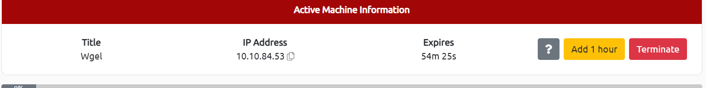 First start the machine
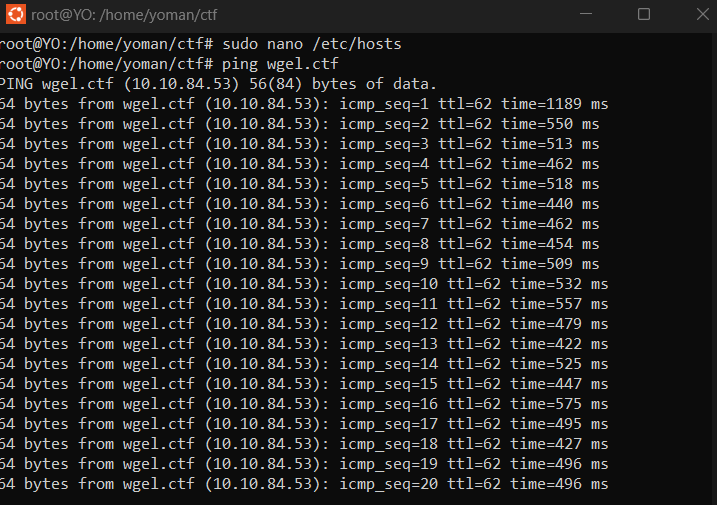
Then ping it to see it it's working or not
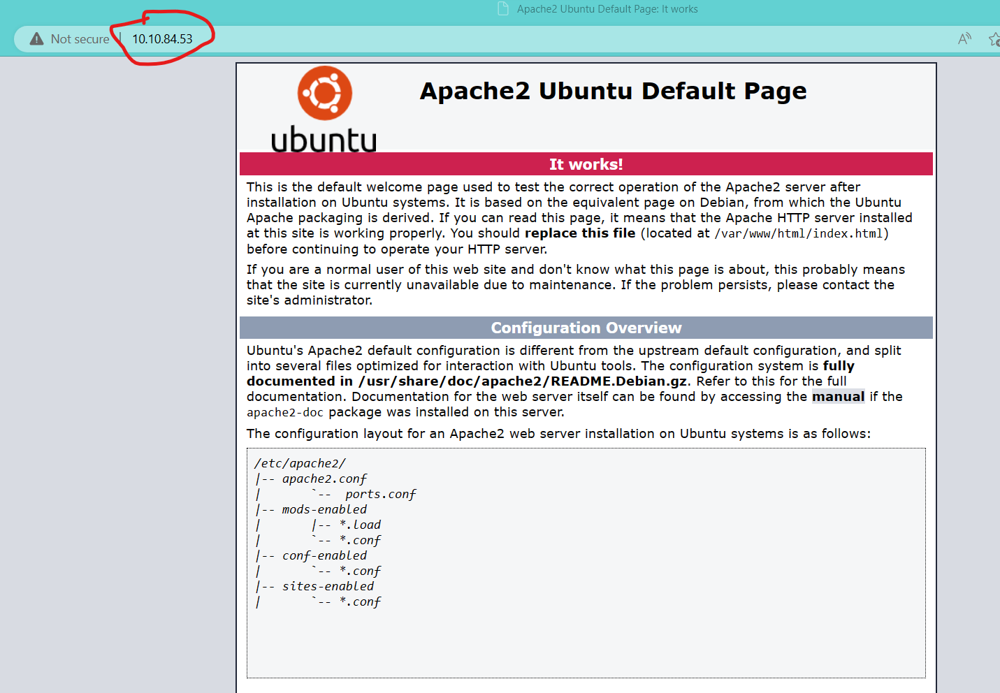 Check the server by just typing the ip address on the browser
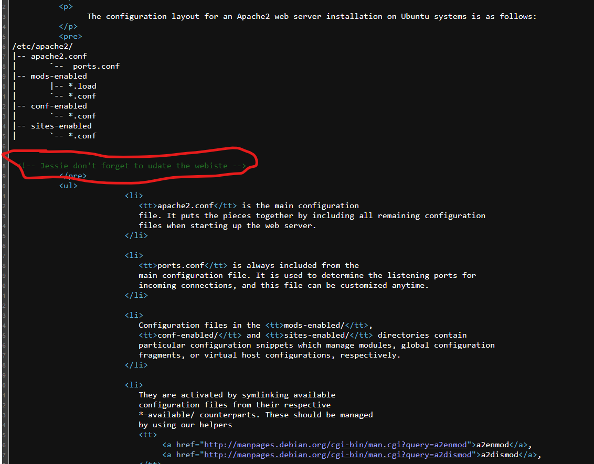check for the page source on the browser like this I found this
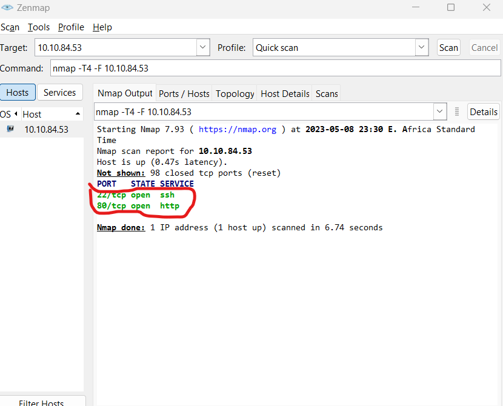 check for the website vulurnerablity on NMAP I found 2 open ports ssh and html
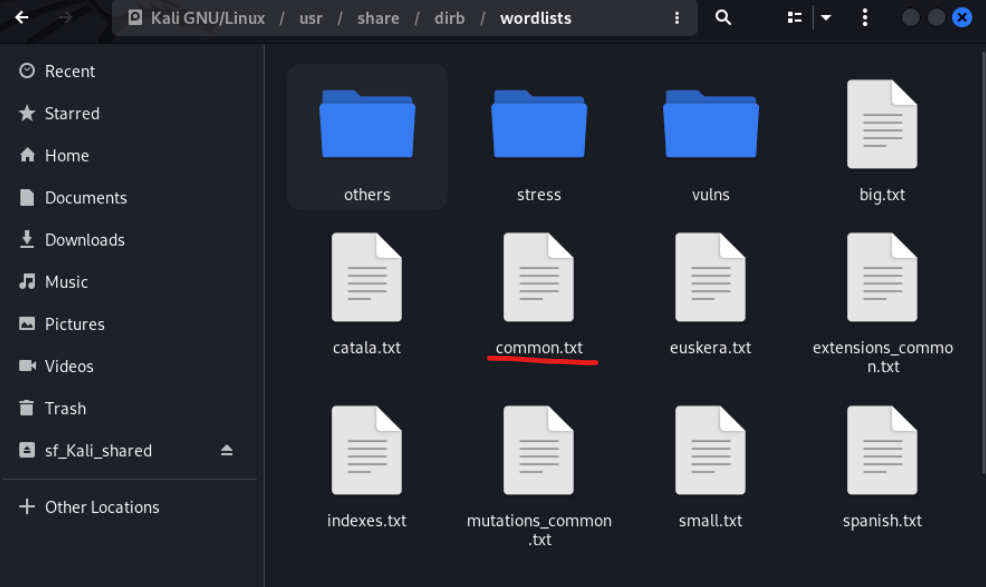 for the directory bruteforce I used common.txt wordlist
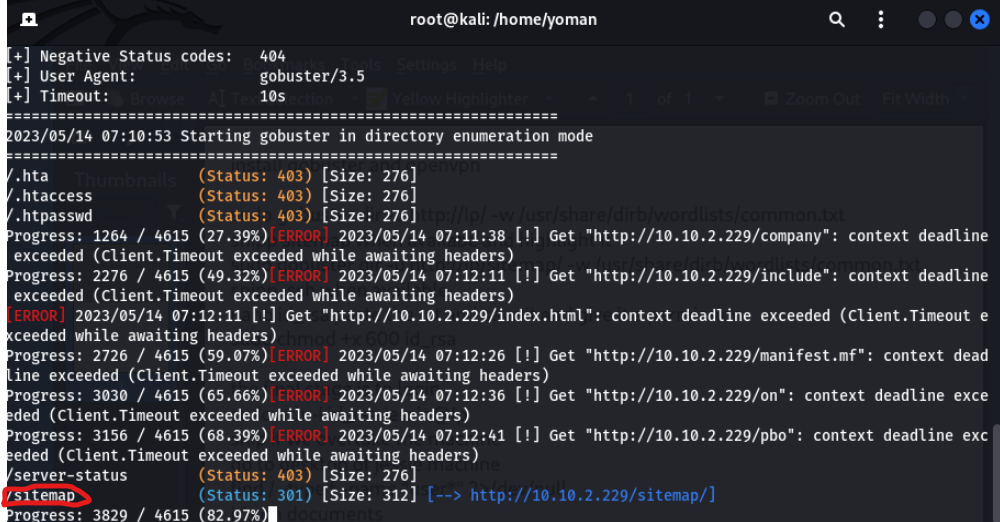 by using gobuster directory bruteforce we found that there is /sitemap let's try what it have.
 the web site /sitemap is like this I found nothing on it so let's bruteforce again by specifying /sitemap
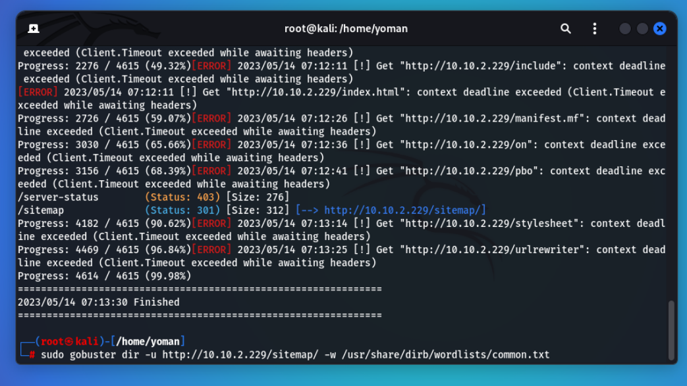 like this
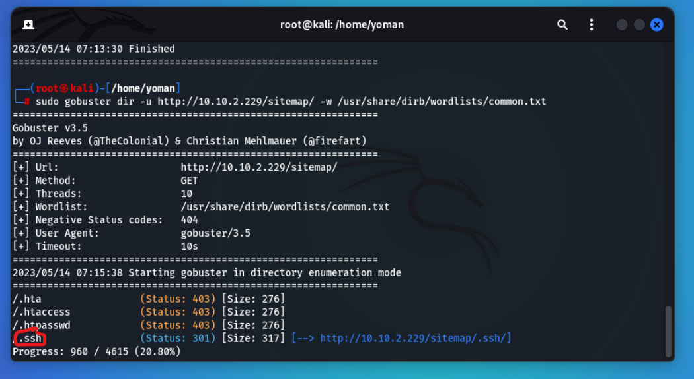 and here we found /.ssh so let's try this
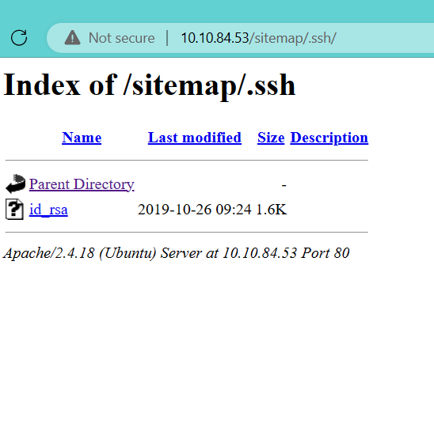 the .ssh result is like this let's check what id_rsa have
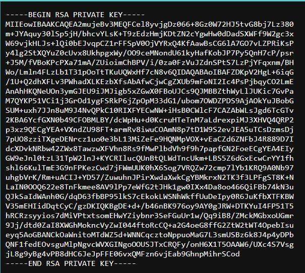 wow and here we got the private key therefor we can attempt to login with this
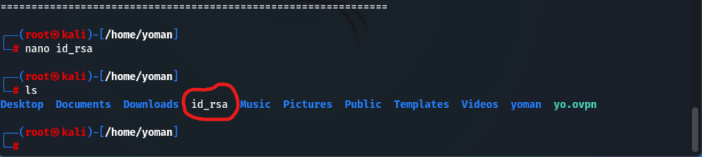 first let's save the file
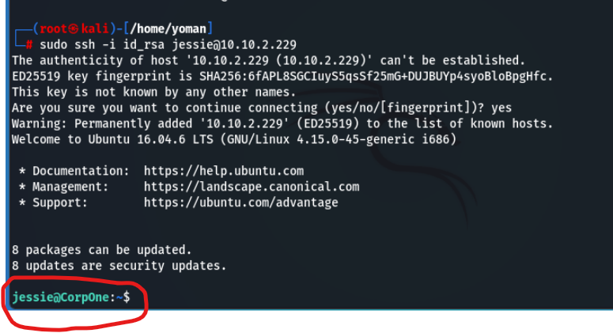 we just loged in with the id_rsa the next mission is to find user_flag we'll just use the find command for that
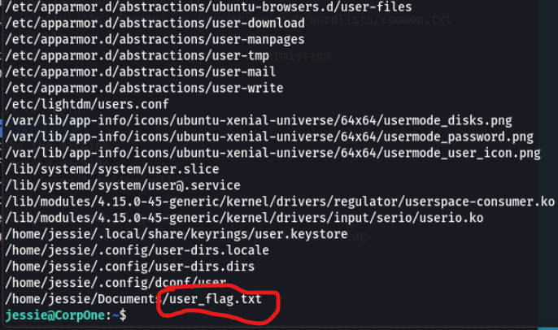 as you can see here we found the user_flag on documents directory let's check what's in it
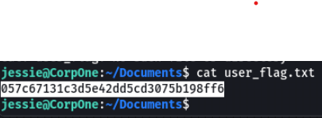 here the .txt file got the user_flag so let's just copy and paste it to tryhackme and mission 1 is completed.
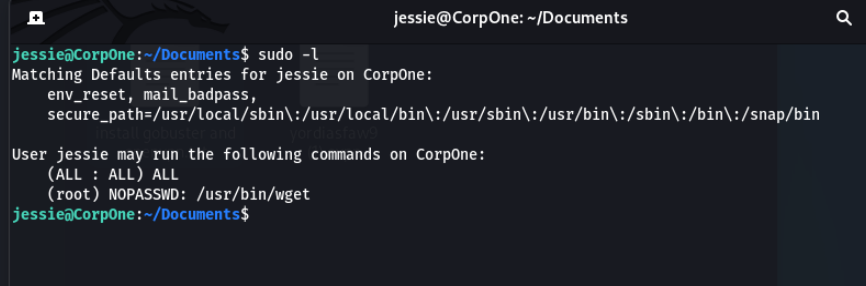 here I found that I can access root without the need to know the password as it say's right there so let's do it
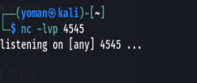 let's create a listening port and wait in the other terminal
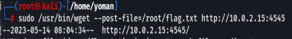 by using this we got the root_flag on the listner let's copy and paste that on the tryhackme
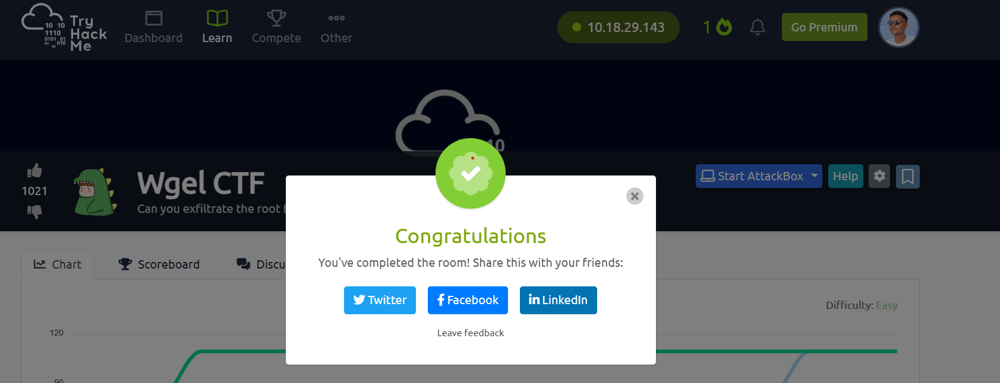 done Mission completed 